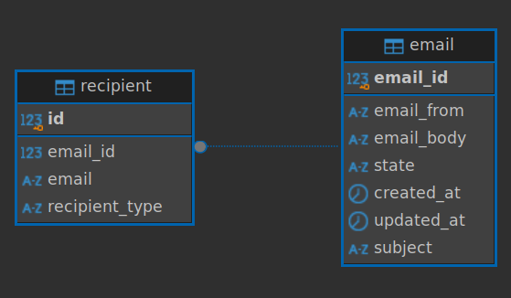

# Email Server REST API Documentation

## Introduction

This application provides a RESTful API for performing Create, Read, Update, and Delete (CRUD) operations.

## Key features:
- Create, update, and delete emails
- Bulk create and delete emails
- Manage recipients (TO/CC)
- Automated spam handling via cron job

# Technological Design

## Containerized Architecture

The application consists of two Docker Containers in production. The first container consists of an image of the
Email Server application, and the second container isolates a PostgreSQL database.
We use a Flyway container to apply SQL migration scripts to the database. In this way,
we can ensure that the schema is properly versioned and updated.

For testing, Flyway is executed within the application context with a lightweight PostgreSQL Docker Testcontainer. 

## Spring Boot Application

The system is written in Java which makes it compatible on many different operating systems. 
It uses the Spring Framework to get advantage of the Inversion of Control (IoC) principle, 
also known as dependency injection. ```Spring Boot``` helps to get started with a prefigured application.

Important Dependencies:
- ```spring-boot-starter-web```: Offers REST-support with annotations like @RestController 
for direct return of JSON-Data. It also includes a prefigured embedded Tomcat. We use
- ```spring-boot-starter-data-jpa```: Preconfigures Hibernate to interact with the Postgres database and includes Batch processing
- ```postgresql```: JDBC driver for database connection
- ```flyway-core```: Automates database migrations and versioning 
- ```spring-boot-starter-test```: Contains tools like JUnit and Mockito for Unit testing

The application is built in a Multi-Layer-Architecture:

- Presentation Layer (Controller)
   - receives HTTP requests and sends responds in JSON format
   - "Headless" presentation, data is only provided for APIs
  
- Business Logic Layer (Service)
   - capsules application logic
   - offers all CRUD-Functionalities
   - calls repositories for data access
  
- Data Access Layer (Repository)
   - Manages data access and interacts with database
   - uses Spring Data JPA for CRUD-Operations on Email Entities
      - It should be noted that the application does not have a Recipient Repository Interface.
      - Recipients are child entities of Email so all operations on Email are applied by the configuration ```CascadeType.ALL```
     
- Database Layer
   - Represented through PostgreSQL and Flyway
   - Database is completely abstracted from application

## PostgreSQL

The decision to use a PostgreSQL database was made out of pragmatic reasons. 
Nevertheless, there are many reasons why PostgreSQL is a good choice, e.g. it's open source, 
free of charge and has a strong support for SQL standards

## Database Schema



As seen in the schema overview, for the use case of our application two database tables are generated: email and recipient.

Recipients table contains an id column, an email (address) column and a type (TO/CC).
Recipients are associated to a specific email so we use a foreign key (email_id) here.

email has a primary key email_id, an email_from column (sender), subject, an email body, state, and two timestamps for creating or updating.

You can see a DDL (Data Definition Language) export of the schema below.

```
   CREATE TABLE public.email (
      email_id serial4 NOT NULL,
      email_from varchar(255) NOT NULL,
      email_body text NULL,
      state varchar(50) NULL,
      created_at timestamp DEFAULT CURRENT_TIMESTAMP NULL,
      updated_at timestamp DEFAULT CURRENT_TIMESTAMP NULL,
      subject varchar(255) DEFAULT 'No Subject'::character varying NOT NULL,
      CONSTRAINT email_pkey PRIMARY KEY (email_id)
   );
   
   CREATE TABLE public.recipient (
	id serial4 NOT NULL,
	email_id int4 NOT NULL,
	email varchar(255) NOT NULL,
	recipient_type varchar(10) NOT NULL,
	CONSTRAINT recipient_pkey PRIMARY KEY (id)
);

ALTER TABLE public.recipient ADD CONSTRAINT recipient_email_id_fkey FOREIGN KEY (email_id) REFERENCES public.email(email_id) ON DELETE CASCADE;
      
```
## Flyway

Hibernate can auto-generate schema updates based on the entity classes but in production it gives us more control
to use a version-controlled tool like Flyway which also supports rollbacks.

# System requirements:

- Operating system: Linux (recommended), Windows, macOS
- Java-Version: OpenJDK 17
- Docker-Version: Docker 20.x with Docker Compose
- Database: Latest PostgreSQL 17.x starts with Docker Compose (no installation required)
- Internet connection required to fetch dependencies and resources by Docker

# Installation and Running Instructions

1. Install OpenJDK 17 (https://www.oracle.com/java/technologies/downloads/?er=221886#java17-linux)
2. Install Docker Desktop (https://www.docker.com/products/docker-desktop/)
    - For Linux:  Ensure your user is added to the docker group: ```sudo usermod -aG docker $USER```
3. Clone the repository: ```git clone https://github.com/david-1904/demo-email-server.git```
4. Open the project in an IDE (IntelliJ IDEA recommended)
5. Ensure Docker Desktop is running

For Linux and Mac:
Start the application by using the shell with: ```./start.sh``

For Windows:
Use Windows Subsystem for Linux (WSL) or use Git Bash for running .sh files. Or use the prompts in the start.sh file
one by one.

This runs a shell script located in the project root folder. 
It automates the process of building, testing and deploying:

- Build the Project
- Stop all containers
- Rebuilds and starts the production containers (postgres, flyway, and email-server-app).
- Run tests with specific test profile and datasource configuration. If the tests fail, all containers are shut down, and the script exits.

# Debugging

The Docker container of the application exposes port 5005 for runtime debugging.
- In your IDE, add a new Run Configuration (Remote JVM Debug) add attach to the exposed port.
- Run ```./start.sh```
- Choose the JVM Debug Run Configuration and start debugging

# REST API usage

The following passage lists the different endpoints exposed by the application, all can be tested by a tool like
Postman or Insomnia.

All endpoints are running on: ```localhost:8080```.

## GET /emails

A GET request will respond with all e-mails from the database in JSON format including the recipients and metadata like timestamps.

## GET /emails/{id}

You can get a specific E-Mail by its ID. The application will give a JSON response with all the including data.

## POST /emails

Save a new e-mail with a request body containing the e-mail information. Subject, emailFrom and emailTo are mandatory.  
An example request is shown below:

    {
        "emailFrom": "sender2@example.com",
        "subject": "More important Update",
        "emailBody": "This is the email content.",
        "emailTo": [
            { "email": "recipient1@example.com" },
            { "email": "recipient2@example.com" },
            { "email": "recipient3@example.com" }
        ],
        "emailCC": [
            { "email": "cc1@example.com" },
            { "email": "cc2@example.com" }
        ]
    }

The internal state of the E-Mail will be set to ```DRAFT```, which you will see in the response as well as time stamps for creating and updating the email:

    {
        "emailId": 4,
        "emailFrom": "sender4@example.com",
        "subject": "Even more important Update",
        "emailBody": "This is the email content.",
        "recipients": [
            {
            "email": "recipient1@example.com",
            "type": "TO"
            },
            {
            "email": "recipient2@example.com",
            "type": "TO"
            },
            {
            "email": "cc1@example.com",
            "type": "CC"
            },
            {
            "email": "cc2@example.com",
            "type": "CC"
            }
        ],
        "state": "DRAFT",
        "createdAt": "2024-12-18T17:22:31.95840715",
        "updatedAt": "2024-12-18T17:22:31.958435874"
    }

## POST /emails/bulk

You can bulk create a list of e-mails. The list has to be sent as request body. 
After batch processing, the application returns a list of successfully created email ids.

## PUT /emails/{id}

You can update an E-Mail while it's state is DRAFT. Otherwise, you will get an 403 Forbidden response.
Again, send the E-Mail as RequestBody and change the fields that should be updated.

## PUT /emails/{id}/send

You can finally send an E-Mail while it's state is DRAFT. Otherwise, you will get an 403 Forbidden response.

## DELETE /emails/{id}

You can delete an E-Mail with a specific ID. If successful, the application will respond with a 204 no content response.
Note that E-Mail's state is set to DELETED, it's not deleted from the database. 
Deleted E-Mails cannot be sent or updated.

## DELETE /emails/bulk?ids={}

You can bulk delete multiple e-mails by sending a list of IDs as request parameter. 
An example could be ```/emails/bulk?ids=2,3```
After batch processing, the application will respond with a 204 no content response. If one more IDs are not found in the database, 
the transaction will roll back and a list of missing ids will be returned.

# Future improvements

- Add more unit and integration tests
- The REST API endpoints are documented but an OpenAPI implementation would provide more benefits (web-based UI for testing and exploring API endpoints)
- An actual service for sending e-mails could be implemented
- Spring Actuator for monitoring the application would be a benefit
- For Flyway, currently there are no dedicated testing scripts, we just use the same scripts for testing and production
- Github Actions as a CI/CD-Pipeline should be implemented to automate testing for every Push, Pull Request or Release
- Mapstruct to automate the conversion between Java objects (DTOs, Entities)
- More endpoints: For example restore deleted emails, retrieve emails for specific recipient, retrieve emails by state